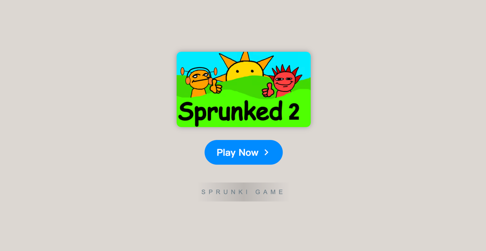

# Sprunked 2.0

    

Welcome to **Sprunked 2.0**, the latest iteration of the beloved game that continues to push the boundaries of creativity and fun. In this guide, we’ll explore everything you need to know about Sprunked 2.0, from its exciting new features to its gameplay enhancements and community engagement. Get ready to dive into a world of music, rhythm, and innovation, where your musical creations come to life in ways you never thought possible.

### Table of Contents
- Introduction
- New Features
- Game Rating & Community Feedback
- Installation Guide
- How to Play
- Tips & Tricks
- Resources

### Introduction

**Sprunked 2.0** brings a fresh and exciting experience to fans of the original game, introducing new features and gameplay modes that elevate the creative possibilities. Whether you’re a returning player or new to the Sprunked universe, this new version is sure to provide hours of entertainment and artistic expression. Prepare to explore new sounds, characters, and interactive gameplay elements as you create your own rhythmic masterpieces.

### New Features

| Feature                | Description                                                                                  |
|------------------------|----------------------------------------------------------------------------------------------|
| **Enhanced Sound Packs** | New, custom sound packs designed to inspire even more creativity and variety in your music.    |
| **Expanded Character Roster** | New characters with unique sound effects and abilities for endless combinations.           |
| **Advanced Game Modes**  | Several gameplay modes designed for different types of players, from casual to hardcore.     |
| **Interactive Interface** | A redesigned, more intuitive user interface for smoother game navigation.                  |
| **Online Play**         | Create and share your compositions with a global community, all from within your browser.     |
| **Free to Play**        | Enjoy all the features of Sprunked 2.0 at no cost—no downloads required!                      |
| **Community Feedback**  | Share your compositions and get feedback from fellow players, improving your creative process. |

### Game Rating & Community Feedback

The game has received high praise from players around the world, with an average rating of **4.5 out of 5 stars**. Fans have expressed excitement over the new features and enhanced user experience. With hundreds of thousands of positive reviews, Sprunked 2.0 is quickly becoming a fan favorite. Here's a glimpse of what the community is saying:

⭐️⭐️⭐️⭐️⭐️ *"A fantastic upgrade to the original. The new features and sound packs really make this game stand out!"*  
⭐️⭐️⭐️⭐️ *"I love the new character abilities—this game keeps getting better and better!"*  
⭐️⭐️⭐️⭐️⭐️ *"Online play is a game changer. Sharing and collaborating with others is a blast!"*

### Installation Guide

**Sprunked 2.0** is available to play directly in your browser. Follow these steps to get started:

1. **Open Browser**: Use a modern browser like Chrome, Firefox, or Safari.
2. **Visit the Website**: Go to [Sprunked 2.0 Official Site](https://sprunkionline.com/sprunked-2-0/).
3. **Start Playing**: Simply click "Play" and you're good to go.

### How to Play

Playing **Sprunked 2.0** is easy and intuitive, but there are plenty of ways to master the game:

1. **Choose Your Characters**: Each character offers a unique sound or musical effect. Drag and drop them into your music creation space.
2. **Build Your Beat**: Mix and match the characters to create different rhythms and melodies.
3. **Share Your Creations**: Once you're satisfied with your music, you can save your creation and share it with the community.

### Tips & Tricks

- **Experiment with Combinations**: Try different character combinations to discover unique sound effects and rhythms.
- **Use the Online Community**: Share your music with others and get valuable feedback to improve your compositions.
- **Master the Interface**: Take time to familiarize yourself with the redesigned interface for a smoother experience.

### Resources

- [Sprunked 2.0 Official Site](https://sprunkionline.com/sprunked-2-0/)

